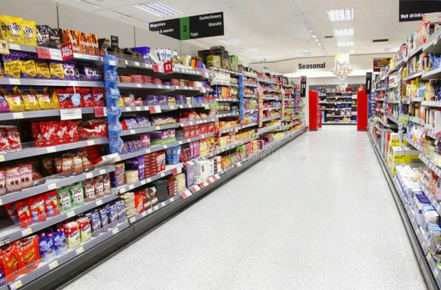
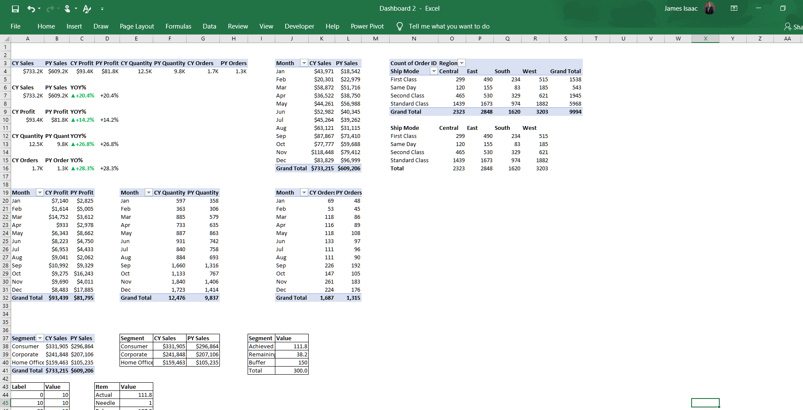
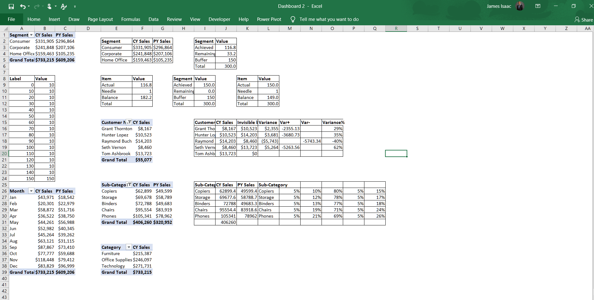
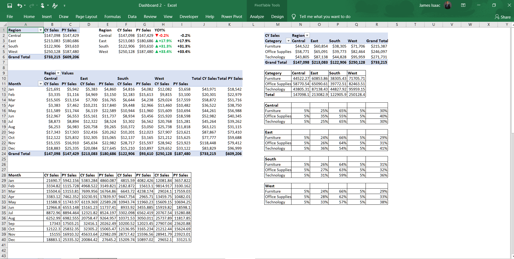
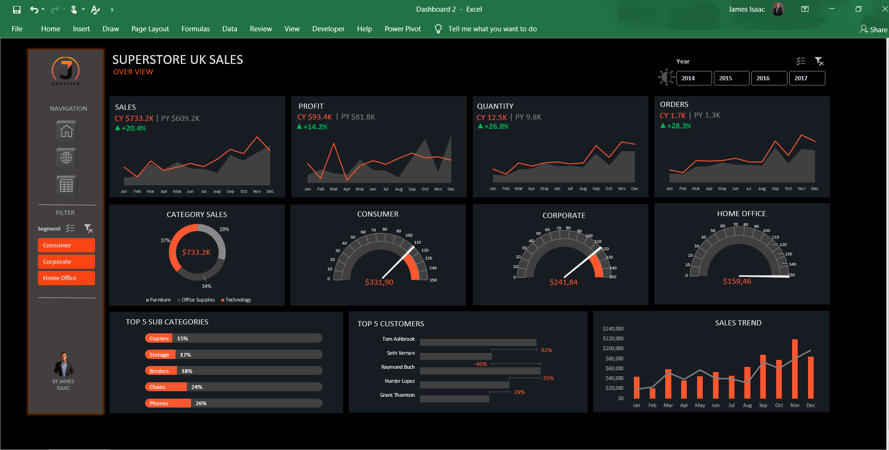
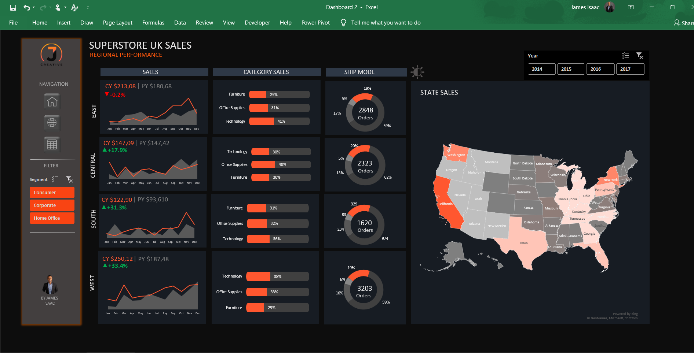
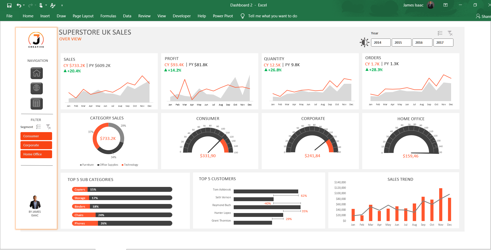
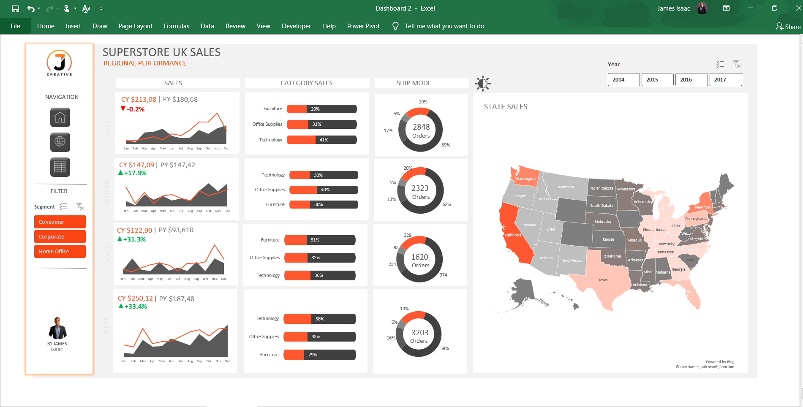

# UK Superstore Sales (2014-2017) - KPI Dashboard in Excel

## Introduction
I wanted to build an interactive sales dashboard in Excel, so I got my hands on a UK Superstore dataset (2014-2017). The goal was to analyze key business metrics like total sales, profit, order trends, top customers, and regional performance.
To make things more engaging, I designed the dashboard with both **light and dark mode** options. This way, users can switch between themes based on their preference.

## About the Dataset
The dataset consists of:
- 21 columns
-  9,995 rows
-   Covers sales data from 2014 to 2017
The dataset includes details like Order Date, Ship Date, Customer Name, Product Category, Sales, Profit, Discount, Quantity, Order ID, Region and others
[Download dataset](Superstore_Dataset.csv)

## Questions I Wanted to Answer
1.	How has sales performance changed from 2014 to 2017?
2.	Which product categories are bringing in the most revenue?
3.	Who are our top customers, and how much are they contributing?
4.	Which regions are performing best in terms of sales and profit?
5.	What shipping mode do most customers prefer?

## Excel Concepts Applied
While working on this project, I used several Excel features to make the dashboard dynamic and visually appealing:
- Power Pivot – For handling large datasets and advanced data modeling.
- Power Query – To clean and transform the raw data before analysis.
- Pivot Tables & Charts – To break down sales performance across different categories and regions.
- DAX Functions – Used to create custom calculations like YoY growth, profit margin, and segment-based KPIs.
- Slicers & Filters – Added for easy category-wise, regional, and yearly analysis.
- Gauge Charts – To show consumer, corporate, and home office performance at a glance.
- Maps – For regional/state-level sales insights.

## Pivot Tables and Analysis
Pivot Table 1                     | Pivot Table 2
:--------------------------------:|:-------------------------:
                 |  
Pivot Table 3                     
                   

## Visualization

#### Sales Performance
- Sales have grown by 20.4% YoY.
- The Consumer segment is leading in revenue contribution.
- 
#### Category & Sub-Category Breakdown
- Technology is the highest-grossing category.
- Phones, Chairs, Binders, Storage, and Copiers are the top 5 best-selling sub-categories.

  

  #### Regional Sales Performance
  - The West region saw the highest growth (+33.4%).
  - The South region also performed well with a 31.3% increase in sales.
    
#### Customer & Order Behavior
- Identified top 5 customers based on total revenue contribution.
- Shipping trends analyzed to understand customer preferences.
[Watch Video](https://drive.google.com/file/d/1dyYur2i34-wnI82m7UonXXUt17aOVqvt/view?usp=sharing)

Dark Mode                         |           Light Mode
:--------------------------------:|:-------------------------:
                      |  
                      |  

## Dashboard Features
- Year Selection (2014-2017)
- Segment Filters (Consumer, Corporate, Home Office)
- Sales Trend Analysis with Bar & Line Charts
- Interactive Maps for Regional Sales
- Gauge Charts for Customer Segments
- Light & Dark Mode Toggle

## Key Takeaways & Recommendations
- Stock Up on Best-Selling Items – Phones and Chairs are driving a lot of revenue. Make sure there’s enough inventory.
- Optimize Order Fulfillment – Reducing shipping time can improve customer experience.
- Expand in High-Growth Regions – The West and South regions are performing well; consider increasing marketing efforts there.
- Loyalty Program for Top Customers – Offering exclusive deals can keep them engaged.

This project was a fun way to explore sales trends while applying Power Pivot, Power Query, and DAX calculations. The dashboard provides interactive insights that help in business decision-making.
- ✅ Created by: James Isaac
- ✅ Built with: Microsoft Excel
- ✅ Dataset: UK Superstore Sales (2014-2017)

